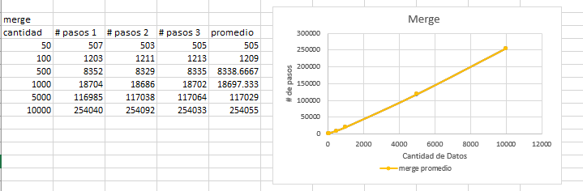
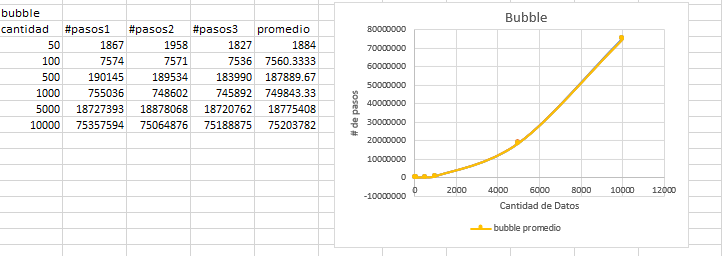
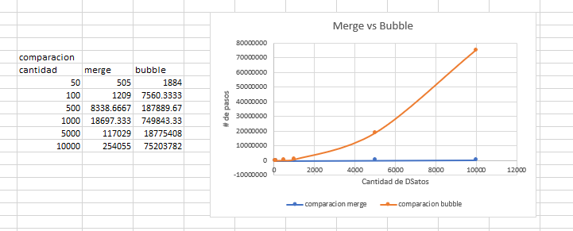

# Merge Sort vs. Bubble Sort

## Merge Sort

Merge Sort is an efficient and stable sorting algorithm that follows the "divide and conquer" paradigm. It divides the input list into smaller sublists, sorts them recursively, and then merges them to produce a sorted list.

The Merge Sort algorithm works by dividing the list into halves until each sublist contains a single element (or is empty). Then, it merges these sublists in a sorted manner to produce a final sorted list.

Here is an overview of the Merge Sort algorithm:

1.  Divide the list into halves recursively until each sublist contains a single element.
2.  Merge the sublists in a sorted manner.

Example of Merge Sort (simplified to show the concept):
```
Input: [5, 3, 8, 4, 2]

Divide: [5, 3, 8] [4, 2]
Divide: [5] [3, 8] [4] [2]
Divide: [5] [3] [8] [4] [2]
Merge: [3, 5] [8] [2, 4]
Merge: [3, 5, 8] [2, 4]
Merge: [2, 3, 4, 5, 8] 

Output: [2, 3, 4, 5, 8]
```

In this example, the Merge Sort algorithm is used to sort the list [5, 3, 8, 4, 2] and for each step, it divides the list into halves and merges the sublists in a sorted manner.

## Bubble Sort

Bubble sort is a simple sorting algorithm that works by repeatedly swapping adjacent elements if they are in the wrong order. It continues to do this until the entire list is sorted.

The bubble sort algorithm works by comparing adjacent elements and swapping them if they are in the wrong order. This process is repeated until the entire list is sorted. The algorithm gets its name from the way smaller elements "bubble" to the top of the list.

Here is an example of the bubble sort algorithm in action:

```
Input: [5, 3, 8, 4, 2]
Output: [2, 3, 4, 5, 8]
```

In this example, the algorithm compares the first two elements of the list, 5 and 3. Since 5 is greater than 3, they are swapped. The algorithm then compares the next two elements, 3 and 8. Since 3 is greater than 8, they are swapped. The algorithm continues this process until the entire list is sorted.

## Time Complexity

-   **Merge Sort:** The time complexity of Merge Sort is O(n log n) in all cases (worst, average, and best).
-   **Bubble Sort:** The time complexity of Bubble Sort is O(n^2) in the average and worst cases, and O(n) in the best case (already sorted list).

## Space Complexity

-   **Merge Sort:** The space complexity of Merge Sort is O(n) due to the additional space required for the sublists during merging.
-   **Bubble Sort:** The space complexity of Bubble Sort is O(1) as it only requires a constant amount of extra space for temporary variables.

## Advantages and Disadvantages

**Merge Sort:**

-   **Advantages:** Efficient for large lists, stable (preserves the relative order of equal elements).
-   **Disadvantages:** Requires additional space.

**Bubble Sort:**

-   **Advantages:** Simple to understand and implement.
-   **Disadvantages:** Inefficient for large lists due to its quadratic time complexity.

## Sort vs. Bubble Sort

The main objective of this project is to empirically compare the efficiency of the Merge Sort and Bubble Sort sorting algorithms. Through experimentation and data analysis, we seek to verify and contrast their theoretical complexities (O(n log n) for Merge Sort and O(n²) for Bubble Sort) in practical scenarios.

**Methodology:**

The project consists of the following steps:

1. **Random Data Generation:**
* The `main.py` script generates lists of random numbers of different sizes (n).
2. **Sorting with Merge Sort and Bubble Sort:**
* The Merge Sort and Bubble Sort algorithms are applied to these lists to sort them.
3. **Step Measurement:**
* The number of steps each algorithm takes during the sorting process is recorded.
4. **Complexity Analysis and Verification:**
* The collected data is analyzed to determine whether the number of steps increases in accordance with the theoretical complexities of the algorithms.
* The `test.py` script is used to calculate and display the ratios between actual steps and theoretical complexities, allowing for empirical verification of the algorithms' behavior.

**How ​​to Run the Code:**

1. **Requirements:**
* Make sure you have Python installed on your system.
2. **Run main.py:**
* Open a terminal or command line.
* Navigate to the project directory.
* Run the [main.py](main.py) script:

```bash python main.py```

## Graphics

Here are the diagrams of the different classification algorithms, comparing the amount of data versus the total number of steps. The final graph is the average of three different tests performed with our implementation of the algorithms:

#### Merge Sort:


#### Bubble Sort:


#### Merge Sort vs Bubble Sort:
Here we can see the comparison and difference between both algorithms with the same data in terms of the total number of steps to reach the solution:



## Sorting Algorithm Complexity Check (Merge Sort and Bubble Sort)

[This Python script](test.py) is used to empirically verify whether the sorting algorithms Merge Sort and Bubble Sort perform according to their expected theoretical complexities: O(n log n) for Merge Sort and O(n²) for Bubble Sort.

**Purpose:**

The main objective of this script is to:

* Evaluate whether the implementation of the Merge Sort and Bubble Sort algorithms exhibits an increase in the number of steps that is proportional to their theoretical complexities.
* Provide empirical evidence that supports or refutes the theoretical complexities of these algorithms.

**Methodology:**

The script performs the following:

1. **Input Data:**
* Uses dictionaries (`merge_data` and `bubble_data`) that contain the average number of steps each algorithm took to sort lists of different sizes (`n`).
2. **Theoretical Complexity Calculation:**
* For Merge Sort, it calculates `n * log2(n)` for each input size n, representing the theoretical complexity O(n log n).
* For Bubble Sort, it calculates `n^2` for each input size n, representing the theoretical complexity O(n²).
3. **Ratio Calculation:**
* Calculates the `ratio` by dividing the actual number of steps (`steps`) by the theoretical value calculated in the previous step.
 4. **Printing Results:**
* Prints the results for each input size n, including the actual number of steps, the theoretical complexity, and the calculated `ratio`.

**Interpretation of Results:**

* If algorithms behave according to their theoretical complexities, the `ratio` should remain approximately constant as the input size n increases.
* A small variation in the ratio is considered normal, while a large variation could mean that the algorithm's implementation does not match its theoretical complexity.

**Usage:**

To run this script, simply save the code in a Python file (e.g., complexity_verification.py) and run it from the command line:

```bash python complexity_verification.py```


## Final Conclusion: Complexity Analysis of Merge Sort and Bubble Sort

After analyzing the results obtained from running the Merge Sort and Bubble Sort algorithms on lists of different sizes, and verifying their behavior using the [test.py](test.py) script, the following conclusions can be drawn:

**Merge Sort:**

* **Efficiency for Large Lists:** The test.py results clearly show that the number of steps performed by Merge Sort grows proportionally to n log n, even for large lists (up to 1,000,000 elements). The ratio between the number of steps and n log n remains constant around 1.99, confirming its theoretical complexity of O(n log n).
* **Practicality:** Despite requiring additional space for merging sublists, Merge Sort's efficiency in terms of time makes it a practical and suitable algorithm for sorting large data sets in various applications.

**Bubble Sort:**

* **Inefficiency for Large Lists:** Data from test.py reveals that the number of steps in Bubble Sort increases quadratically with the list size, as expected for an O(n²) algorithm. The ratio between the number of steps and n² remains constant around 0.75, confirming its theoretical complexity.
* **Simplicity vs. Efficiency:** Although Bubble Sort is easy to implement and understand, its inefficiency makes it unsuitable for sorting large lists. Its use is limited to small lists or educational purposes, where simplicity is more important than efficiency.

**Comparison and Recommendations:**

* **Merge Sort is Superior for Large Lists:** Empirical evidence confirms that Merge Sort is significantly more efficient and practical for sorting large lists compared to Bubble Sort.

* **Bubble Sort Use Cases:** Bubble Sort can be useful in scenarios where lists are small or when algorithm simplicity is paramount, such as in educational settings.
* **Practical Considerations:** When choosing a sorting algorithm, it is crucial to consider data size and efficiency requirements. For applications that handle large data sets, Merge Sort is the preferred choice due to its time efficiency.

In summary, this empirical analysis, supported by test.py data, reinforces the theoretical understanding of the complexities of Merge Sort and Bubble Sort. Merge Sort proves to be an efficient and practical algorithm for large lists, while Bubble Sort is more suitable for small lists or educational purposes due to its simplicity but inefficiency on large data sets.

## ✒️ Authors and Codes:

- Andres Cerdas Padilla  / 20231020053
- Juan Esteban Bedoya Lautero / 20231020057