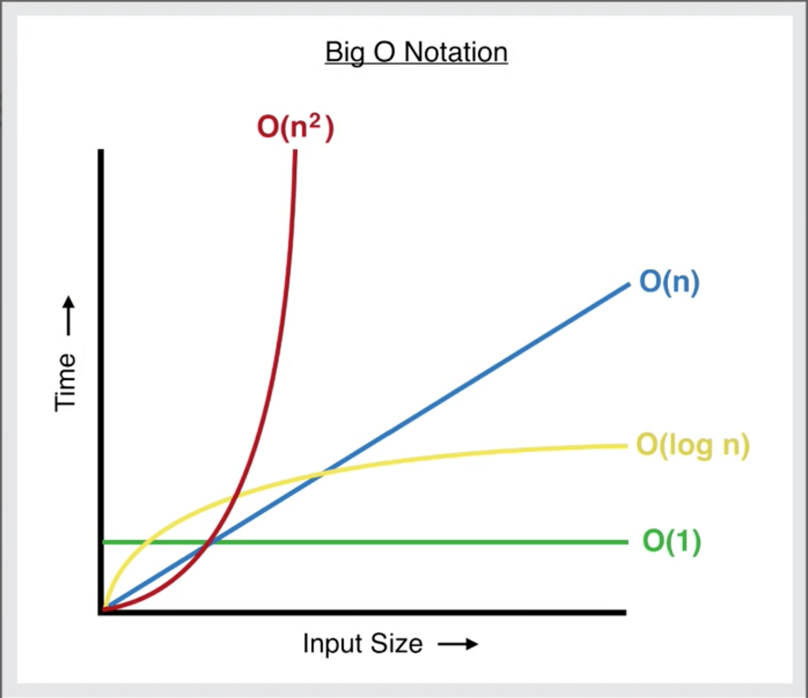

# Ciencias de la computación I

A continuación se encuentran los temas de primer corte.

- **[Complejidad](#Complejidad)** 
    - Notación Big O

- **[Tipos de algoritmo](#Tipos-de-algoritmo)**
    - [Fuerza bruta (Combinación)](#Fuerza-bruta-(Combinación))
    - [Divide y vencerás](#Divide-y-vencerás)
    - [Voraces (Greedy)](#Voraces-(Greedy))
    - [Backtracking](#Backtracking)
    - [Ramificación y poda](#Ramificación-y-poda)
    - [Programación dinámica](#Programación-dinámica)

- **[Algoritmos de búsqueda y ordenamiento](#Algoritmos-de-búsqueda-y-ordenamiento)**
    - [Burbuja](#burbuja)
    - [Merge sort](#merge-sort)
    - [Quick sort](#quick-sort)
    - [Insertion sort](#insertion-sort)
    - [Heapsort](#heapsort)

- **[Estructuras de datos lineales](#estructuras-de-datos-lineales)**
    - [Array](#array)
    - [Listas](#listas)
        - [Simple](#simple)
        - [Set](#set)
        - [Map](#map)
        - [Stack](#stack)
        - [Queue](#queue)

## Complejidad

**O(n) Peor de los casos**
La notación Big O se usa para describir el límite superior del tiempo de ejecución de un algoritmo. Nos dice el tiempo máximo que un algoritmo podría tomar para completar, dado el tamaño de la entrada.

- O(1): tiempo constante. 
El algoritmo toma la misma cantidad de tiempo independientemente del tamaño de entrada. 
Ejemplo: acceder a un elemento en una matriz.

- O(n): tiempo lineal. 
El tiempo de ejecución del algoritmo crece linealmente con el tamaño de entrada. 
Ejemplo: iterando a través de una lista.

- O(n log2 n): tiempo log-lineal.  
Este tiempo de ejecución es más eficiente que el cuadrático pero más lento que el lineal.  
Ejemplo: algoritmos eficientes de ordenamiento como *merge sort* y *heap sort*.

- O(n2): tiempo cuadrático. 
El tiempo de ejecución crece cuadráticamente a medida que aumenta el tamaño de la entrada.
Ejemplo: clasificación de burbujas.

**Θ(n) Caso promedio**
La notación Theta se usa para describir el límite exacto del tiempo de ejecución de un algoritmo. Nos dice el escenario de caso promedio, donde el tiempo de ejecución está vinculado tanto por encima como por debajo de la misma función.

**Ω(n) Mejor de los casos**
La notación Omega se usa para describir el límite inferior del tiempo de ejecución de un algoritmo. Nos dice el tiempo mínimo que tomará un algoritmo para completar, dado el tamaño de la entrada.

## Tipos de algoritmo
### Fuerza bruta (Combinación)
### Divide y vencerás
### Voraces (Greedy)
### Backtracking
### Ramificación y poda
### Programación dinámica

## Algoritmos de búsqueda y ordenamiento
### Burbuja
### Merge sort
### Quick sort
### Insertion sort
### Heapsort

## Estructuras de datos lineales
### Array
### Listas
#### Simple
#### Set
#### Map
#### Stack
#### Queue