# Ciencias de la computación I

A continuación se encuentran los temas de primer corte.

- **[Complejidad](#Complejidad)** 
    - Notación Big O

- **[Tipos de algoritmo](#Tipos-de-algoritmo)**
    - [Fuerza bruta (Combinación)](#Fuerza-bruta-(Combinación))
    - [Divide y vencerás](#Divide-y-vencerás)
    - [Voraces (Greedy)](#Voraces-(Greedy))
    - [Backtracking](#Backtracking)
    - [Ramificación y poda](#Ramificación-y-poda)
    - [Programación dinámica](#Programación-dinámica)

- **[Algoritmos de búsqueda y ordenamiento](#Algoritmos-de-búsqueda-y-ordenamiento)**
    - [Burbuja](#burbuja)
    - [Merge sort](#merge-sort)
    - [Quick sort](#quick-sort)
    - [Insertion sort](#insertion-sort)
    - [Heapsort](#heapsort)

- **[Estructuras de datos lineales](#estructuras-de-datos-lineales)**
    - [Array](#array)
    - [Listas](#listas)
        - [Simple](#simple)
        - [Set](#set)
        - [Map](#map)
        - [Stack](#stack)
        - [Queue](#queue)

## Complejidad

**O(n) Peor de los casos**
La notación Big O se usa para describir el límite superior del tiempo de ejecución de un algoritmo. Nos dice el tiempo máximo que un algoritmo podría tomar para completar, dado el tamaño de la entrada.

- O(1): tiempo constante. 
El algoritmo toma la misma cantidad de tiempo independientemente del tamaño de entrada. 
Ejemplo: acceder a un elemento en una matriz.

- O(n): tiempo lineal. 
El tiempo de ejecución del algoritmo crece linealmente con el tamaño de entrada. 
Ejemplo: iterando a través de una lista.

- O(n log2 n): tiempo log-lineal.  
Este tiempo de ejecución es más eficiente que el cuadrático pero más lento que el lineal.  
Ejemplo: algoritmos eficientes de ordenamiento como *merge sort* y *heap sort*.

- O(n2): tiempo cuadrático. 
El tiempo de ejecución crece cuadráticamente a medida que aumenta el tamaño de la entrada.

Ejemplo: clasificación de burbujas.

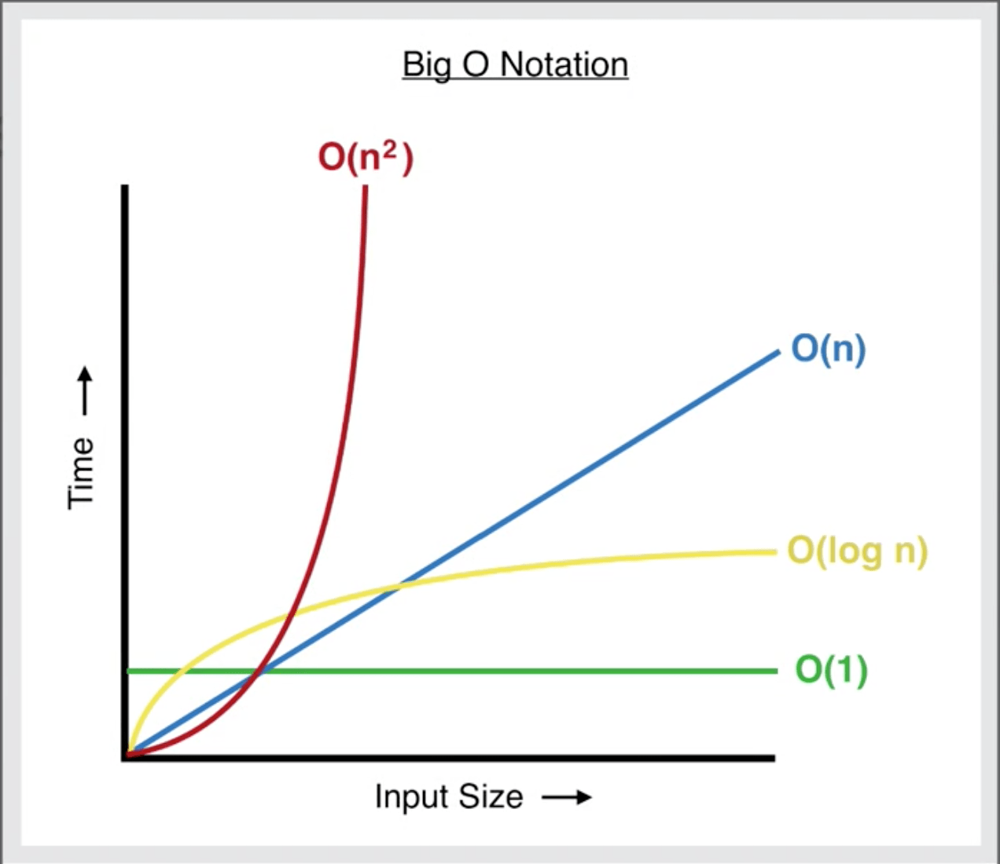

**Θ(n) Caso promedio**
La notación Theta se usa para describir el límite exacto del tiempo de ejecución de un algoritmo. Nos dice el escenario de caso promedio, donde el tiempo de ejecución está vinculado tanto por encima como por debajo de la misma función.

**Ω(n) Mejor de los casos**
La notación Omega se usa para describir el límite inferior del tiempo de ejecución de un algoritmo. Nos dice el tiempo mínimo que tomará un algoritmo para completar, dado el tamaño de la entrada.

## Tipos de algoritmo

### Fuerza bruta (Combinación)
Los algoritmos de fuerza bruta intentan todas las combinaciones posibles para resolver un problema. Aunque garantizan encontrar una solución, suelen ser ineficientes para entradas grandes. Se usan cuando no hay una estrategia mejor conocida o cuando el espacio de soluciones es pequeño.  
**Complejidad común:** O(n!) o O(2n), dependiendo del problema (por ejemplo, permutaciones o subconjuntos).

### Divide y vencerás
Este enfoque divide el problema en subproblemas más pequeños del mismo tipo, resuelve cada uno de forma recursiva y luego combina las soluciones. Es eficiente y se usa ampliamente en algoritmos de ordenamiento y búsqueda.  
**Complejidad común:** O(n log n), como en *merge sort* o *quick sort*.

### Voraces (Greedy)
Los algoritmos voraces toman decisiones óptimas en cada paso con la esperanza de encontrar la solución global óptima. No siempre garantizan una solución óptima, pero son rápidos y simples. Funcionan bien cuando el problema tiene estructura de subproblemas óptimos.  
**Complejidad común:** O(n log n) o O(n), según el problema.

### Backtracking
El backtracking construye soluciones paso a paso y retrocede cuando una opción no lleva a una solución válida. Es útil para problemas de decisión, generación de combinaciones o permutaciones, como el sudoku o el problema de las n reinas.  
**Complejidad común:** O(2n) o peor en muchos casos, aunque puede reducirse con podas inteligentes.

**Ejemplo:** Buscar la salida de un laberinto.

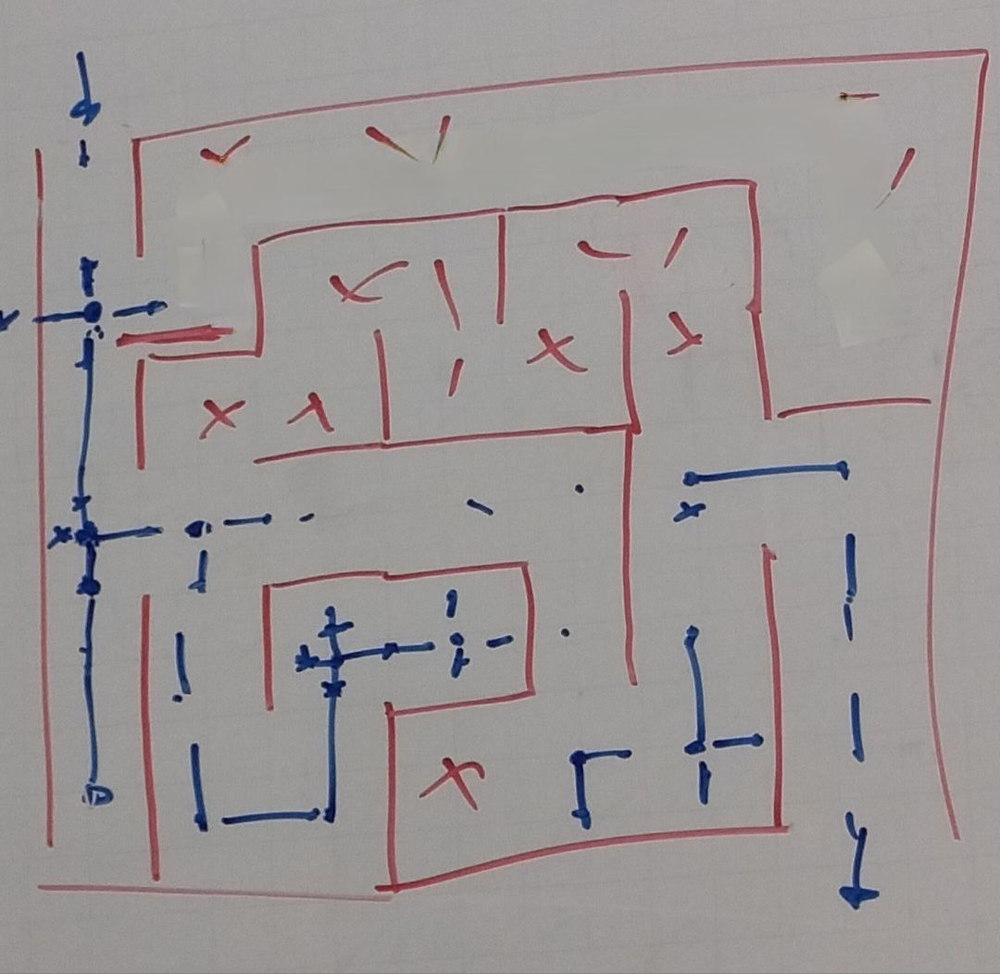

### Ramificación y poda
Extensión del backtracking que incluye técnicas para evitar explorar ramas del árbol de soluciones que no pueden conducir a una solución óptima. Muy usado en problemas de optimización como el *knapsack problem* o el *viajero*.  
**Complejidad común:** Similar a backtracking, pero con mejoras prácticas significativas en muchos casos.

**Ejemplo:** Obtener la solución a un *Sliding Puzzle*.

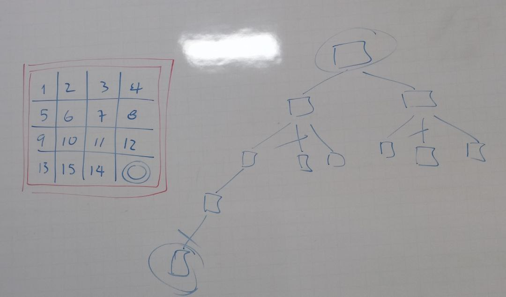

### Programación dinámica
Resuelve problemas dividiéndolos en subproblemas y **almacenando los resultados** para evitar cálculos repetidos. Es eficiente para problemas con subestructuras óptimas y solapamiento de subproblemas (**heurísticas**), como Fibonacci, mochila o cadenas.

**Ejemplo 1:** Buscar el máximo de dulces que se pueden obtener, si al tomar una casilla se borra la de abajo y las de ambos sentidos.

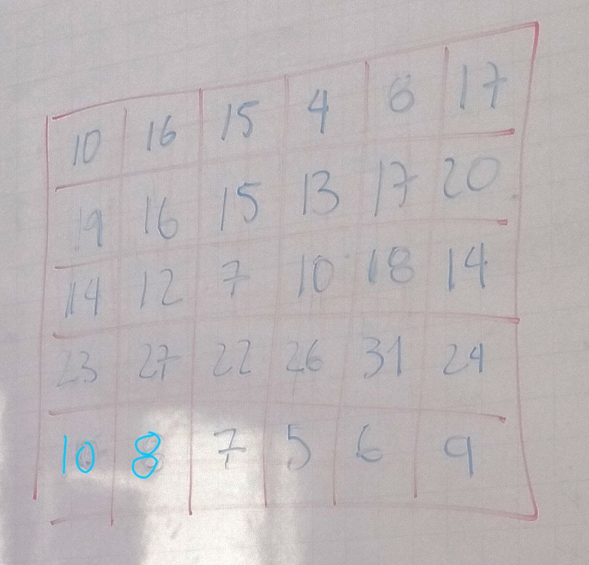

**Ejemplo 2:** Buscar el minimo de petardos necesarios para saber cuanto resiste una cantidad de buzones. 

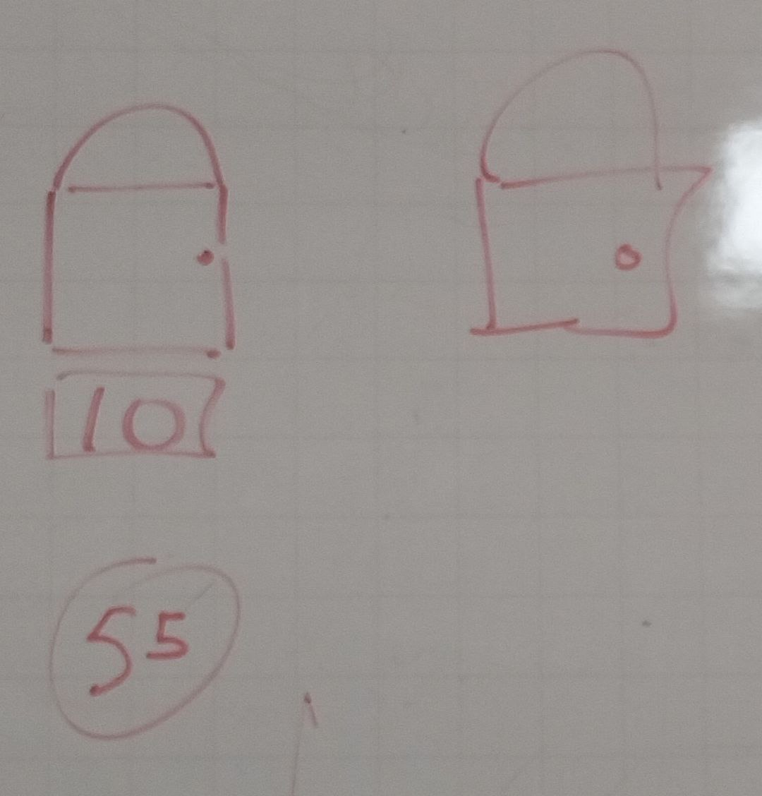

## Algoritmos de búsqueda y ordenamiento

### Burbuja
El algoritmo de burbuja compara pares de elementos adyacentes y los intercambia si están en el orden incorrecto. Este proceso se repite hasta que la lista está ordenada. Es simple pero ineficiente, especialmente con listas grandes.  
**Complejidad promedio y peor caso:** O(n2)  
**Mejor caso (lista ya ordenada):** O(n)

**Ejemplo:**

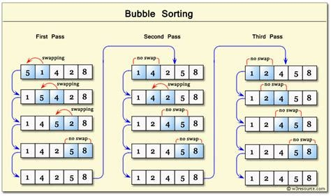

### Merge sort
Merge sort es un algoritmo de tipo divide y vencerás. Divide el arreglo en mitades, ordena cada mitad recursivamente y luego las combina en una sola lista ordenada. Es muy eficiente y estable.  
**Complejidad en todos los casos:** O(n log n)

**Ejemplo:** 

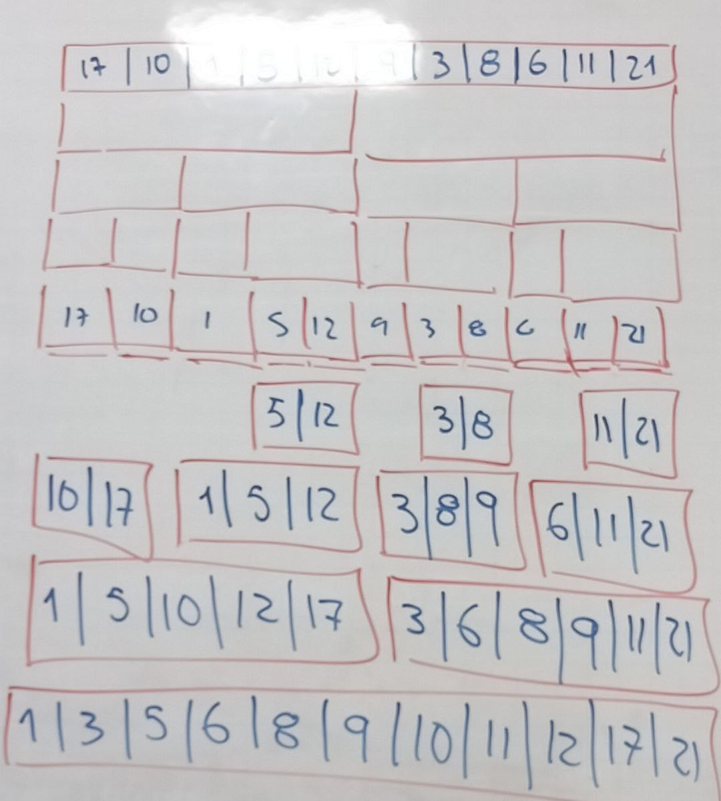

### Quick sort
Quick sort selecciona un "pivote", divide el arreglo en dos partes (menores y mayores al pivote) y aplica el mismo procedimiento a cada parte. Aunque no es estable, es muy rápido en la práctica.  
**Complejidad promedio:** O(n log n)  
**Peor caso:** O(n2) (cuando el pivote es mal elegido)

**Ejemplo:**

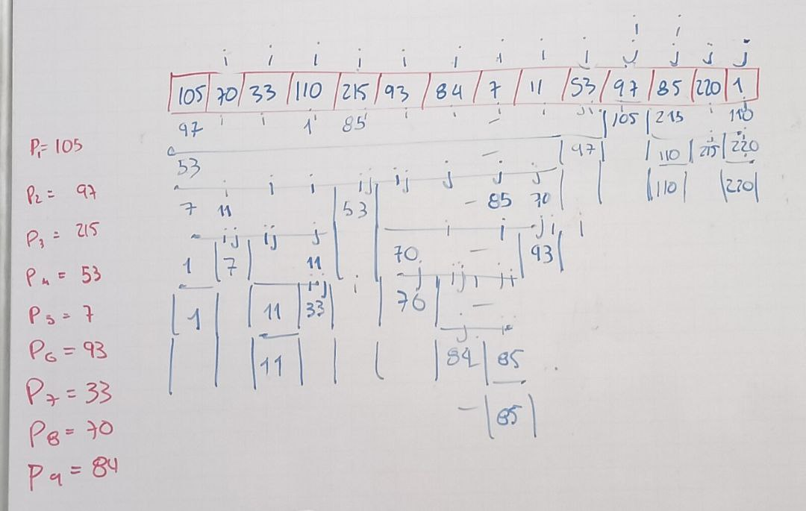

### Insertion sort
Insertion sort construye una lista ordenada una entrada a la vez, insertando cada nuevo elemento en su lugar correspondiente. Funciona bien para listas pequeñas o casi ordenadas.  
**Complejidad promedio y peor caso:** O(n2)  
**Mejor caso (lista ya ordenada):** O(n)

**Ejemplo:**

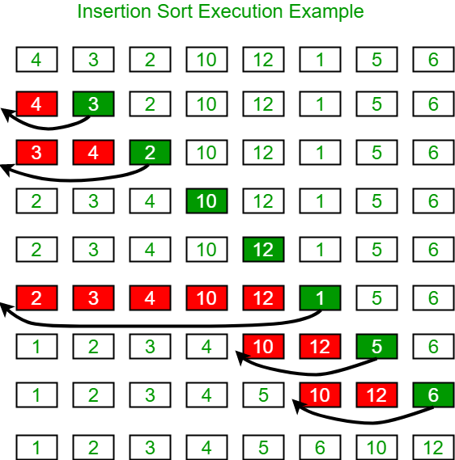

### Heapsort
Heapsort usa una estructura llamada heap para seleccionar el siguiente elemento más grande (o pequeño) de forma eficiente. Es eficiente y no usa memoria adicional significativa, pero no es estable.  
**Complejidad en todos los casos:** O(n log n)

**Ejemplo:**

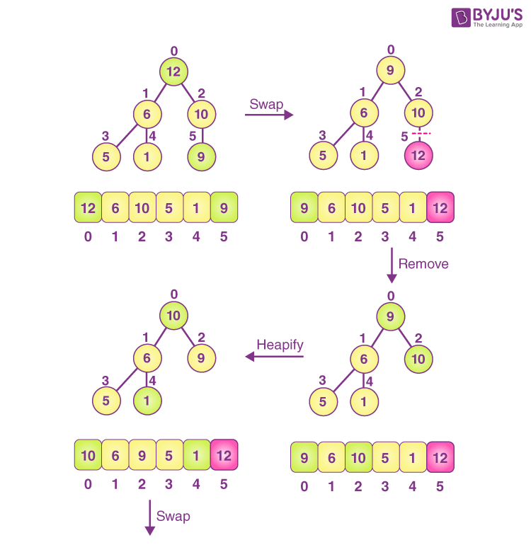

## Estructuras de datos lineales

### Array
Un array es una colección ordenada de elementos del mismo tipo, almacenados de manera contigua en memoria. En lenguajes como C o Java, los arrays tienen un tamaño fijo. En Python, su equivalente más cercano sería la lista (`list`), aunque también existe el módulo `array` para uso más eficiente en ciertos casos.  
- **Ordenado:** Sí  
- **Mutables:** Sí  
- **Acceso directo:** Sí (por índice)  
- **Métodos comunes:** acceso por índice, recorrido, modificación

### Listas
Las listas son colecciones ordenadas y mutables de elementos que pueden ser de distintos tipos. Son muy flexibles y ampliamente utilizadas. En Python, la estructura `list` permite agregar, eliminar y modificar elementos fácilmente.  
- **Ordenado:** Sí  
- **Mutables:** Sí  
- **Métodos comunes:** `.append()`, `.remove()`, `.pop()`, `.insert()`, `.sort()`, `.reverse()`

#### - Simple
Una lista simple (o lista enlazada simple) está compuesta por nodos donde cada uno apunta al siguiente. A diferencia de las listas en Python, no permite acceso aleatorio por índice, pero facilita inserciones y eliminaciones en posiciones arbitrarias.  
- **Ordenado:** Sí  
- **Mutables:** Sí  
- **Características:** uso eficiente de memoria para inserciones y eliminaciones, recorrido secuencial

#### - Set
Un set (conjunto) es una colección no ordenada de elementos únicos. No permite elementos duplicados y se usa comúnmente para pruebas de pertenencia y operaciones de teoría de conjuntos como unión o intersección.  
- **Ordenado:** No  
- **Mutables:** Sí (aunque existe `frozenset`, que es inmutable)  
- **Métodos comunes:** `.add()`, `.remove()`, `.union()`, `.intersection()`, `.difference()`

#### - Map
También conocido como diccionario (`dict` en Python), un map es una colección de pares clave-valor. Las claves deben ser únicas e inmutables, mientras que los valores pueden ser de cualquier tipo.  
- **Ordenado:** Sí (desde Python 3.7)  
- **Mutables:** Sí  
- **Métodos comunes:** `.get()`, `.keys()`, `.values()`, `.items()`, asignación por clave

#### - Stack
Una pila (stack) es una estructura que sigue el principio **LIFO** (Last In, First Out). El último elemento en entrar es el primero en salir. Se puede implementar con listas en Python, aunque también existe `collections.deque` para mejor rendimiento.  
- **Ordenado:** Implícitamente  
- **Mutables:** Sí  
- **Métodos comunes:** `.append()` para push, `.pop()` para pop

#### - Queue
Una cola (queue) sigue el principio **FIFO** (First In, First Out). El primer elemento en entrar es el primero en salir. Python ofrece varias implementaciones: listas (aunque no recomendadas), `collections.deque` y `queue.Queue`.  
- **Ordenado:** Implícitamente  
- **Mutables:** Sí  
- **Métodos comunes:** `.append()` para encolar, `.popleft()` con `deque` para desencolar

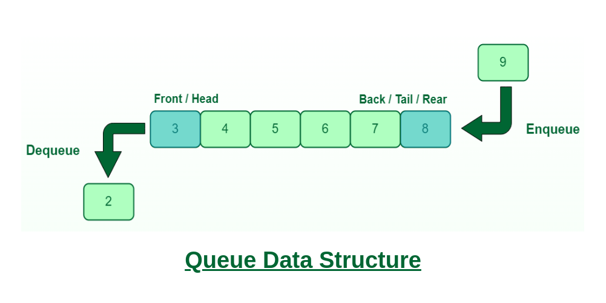