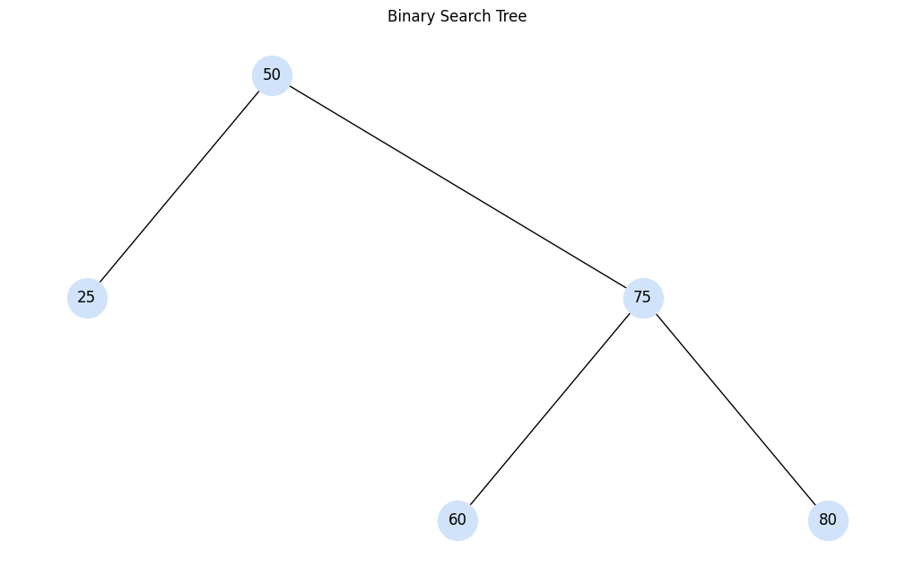
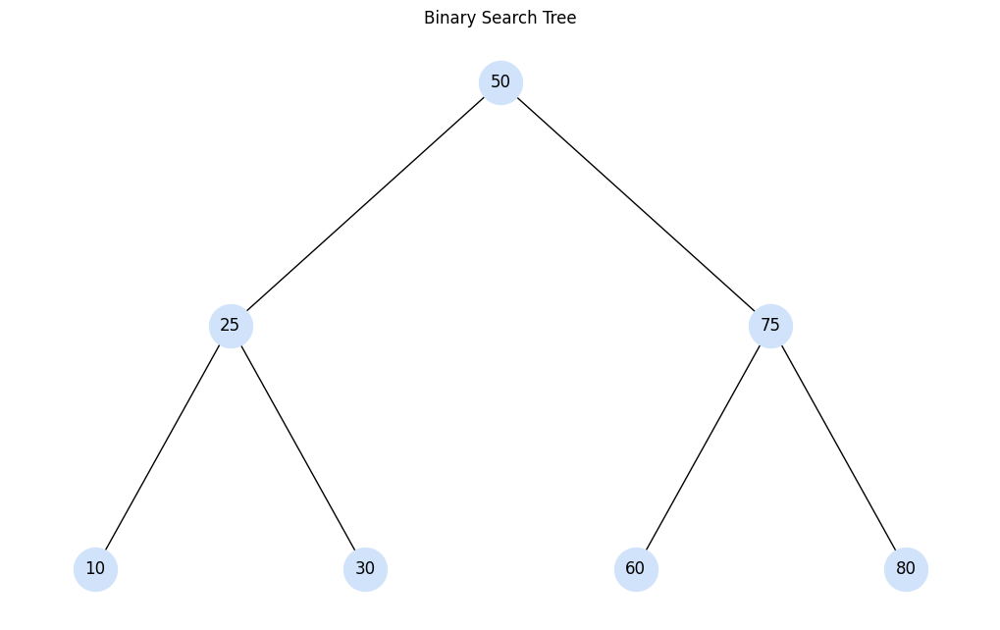

# Ciencias de la computación I

A continuación se encuentran los temas de segundo corte.

- **[Notación -fija](#Notación--fija)** 
    - [Notación infija](#notación-infija)
    - [Notación posfija](#notación-posfija)
    - [Conversión de infija a posfija](#conversión-de-infija-a-posfija)
    - [Notación prefija](#notación-prefija)

- **[Árboles Binarios](#árboles-binarios)**
    - [Propiedades](#propiedades)
    - [Recorridos](#recorridos)
    - [Operaciones principales](#operaciones-principales)
    - [Tipos de árboles binarios](#tipos-de-árboles-binarios)
    - [Algoritmos de búsqueda](#algoritmos-de-búsqueda)

## Notación -fija
En matemáticas y ciencias de la computación, las notaciones infija, posfija y prefija son formas de escribir expresiones aritméticas. Cada una tiene reglas distintas sobre el orden de los operandos y los operadores, lo cual influye en cómo se evalúan y procesan las expresiones, especialmente en estructuras como árboles de expresión, compiladores o calculadoras.

### Notación infija
Es la notación más común y la que usamos habitualmente en matemáticas. El operador se coloca entre los operandos. Se requiere el uso de paréntesis o reglas de precedencia para determinar el orden de evaluación.  

| Operación                            | Símbolos/Funciones        |
|--------------------------------------|---------------------------|
| Paréntesis                           | `()`                      |
| Potenciación                         | `**`                      |
| Negación y signo                     | `-`, `+` (unarios)        |
| Multiplicación, división, módulo     | `*`, `/`, `//`, `%`       |
| Suma y resta                         | `+`, `-`                  |
| Comparaciones                        | `==`, `!=`, `<`, `>`, ... |
| Lógicos AND                          | `and`                     |
| Lógicos OR                           | `or`                      |


**Ejemplo:** `3 + 4 * 2`  
**Evaluación:** Multiplicación antes que suma → `3 + (4 * 2) = 11`

### Notación posfija
También conocida como *notación postfija* o *notación polaca inversa*. En esta notación, el operador se coloca después de los operandos. No requiere paréntesis, ya que el orden de evaluación está definido por la posición de los elementos. Muy utilizada en evaluadores de expresiones como las pilas.  
**Ejemplo:** `3 4 2 * +`  
**Evaluación:** Multiplica `4 * 2 = 8`, luego suma `3 + 8 = 11`

### Notación prefija
También conocida como *notación polaca*. Aquí, el operador se coloca antes de los operandos. Al igual que la posfija, no necesita paréntesis y también se evalúa fácilmente usando estructuras como pilas o árboles de expresión.  
**Ejemplo:** `+ 3 * 4 2`  
**Evaluación:** Multiplica `4 * 2 = 8`, luego suma `3 + 8 = 11`

A continuación, una imagen con las tres notaciones:


### Conversión de infija a posfija
A continuación se presenta un algoritmo en pseudocódigo que convierte una expresión en notación infija a notación posfija. Utiliza una pila para manejar la jerarquía de operadores y los paréntesis:

```plaintext
PROCEDIMIENTO Convertir_Infija_a_Postfija(exp_infija)

 DEFINIR pila

 INICIAR pila como una pila vacía

 DEFINIR exp_postfija como una cadena vacía

 PARA cada símbolo en exp_infija HACER

  SI el símbolo es un operando (número o variable)
   Añadir el símbolo a exp_postfija

  SI no
   SI el símbolo es un paréntesis izquierdo "("
    Insertar el símbolo en la pila

   SI no
    SI el símbolo es un paréntesis derecho ")"
     MIENTRAS la pila no esté vacía Y el tope de la pila no sea "("
      Añadir el tope de la pila a exp_postfija
      Sacar el tope de la pila
     FIN MIENTRAS

     Sacar el tope de la pila (que debe ser "(")

    SI no
     SI el símbolo es un operador
      MIENTRAS la pila no esté vacía Y el operador actual tiene menor o igual precedencia que el operador en el tope de la pila
       Añadir el tope de la pila a exp_postfija
       Sacar el tope de la pila
      FIN MIENTRAS

      Insertar el símbolo en la pila
     FIN SI
    FIN SI
   FIN SI
  FIN SI

 FIN PARA

 MIENTRAS la pila no esté vacía
  Añadir el tope de la pila a exp_postfija
  Sacar el tope de la pila
 FIN MIENTRAS

 RETORNAR exp_postfija

FIN PROCEDIMIENTO
```

## Árboles Binarios

Un árbol binario es una estructura de datos jerárquica en la que cada nodo tiene como máximo dos hijos: uno izquierdo y uno derecho. Se utilizan comúnmente para búsquedas, ordenamientos y representaciones jerárquicas.

### Propiedades

- **Menores o iguales a la izquierda:** En un árbol binario de búsqueda (BST), los valores menores o iguales al nodo actual se ubican en la subrama izquierda, mientras que los mayores van a la derecha.
- **Grado:** Es 2, porque cada nodo puede tener como máximo dos hijos.
- **Altura:** Número máximo de aristas desde la raíz hasta una hoja.
- **Niveles:** Corresponden a las profundidades del árbol desde la raíz (nivel 0).
- **Nodos por nivel:** Un árbol binario puede tener hasta `2^n` nodos en el nivel `n`.
- **Altura de un árbol balanceado:** Aproximadamente `log₂(n)`, donde `n` es el número total de nodos.
- **Raíz:** Es el nodo madre o principal del árbol.
- **Hojas:** Son los nodos terminales que no tienen hijos.

### Recorridos

- **In-orden (in-order):** Se lee en el orden: izquierda → raíz → derecha. Esto permite recorrer un BST en orden ascendente.
- También existen:
  - **Pre-orden:** raíz → izquierda → derecha
  - **Post-orden:** izquierda → derecha → raíz

### Operaciones principales

- **Agregar nodo:** Se compara el nuevo valor con los nodos existentes, y se coloca a la izquierda si es menor o igual, o a la derecha si es mayor.
- **Eliminar nodo:**
  - Si es una hoja: se elimina directamente.
  - Si tiene un solo hijo: se reemplaza con su hijo.
  - Si tiene dos hijos: se busca su sucesor (el nodo más pequeño del subárbol derecho), se reemplaza el valor, y luego se elimina el sucesor.
- **Buscar nodo:** Se recorre el árbol comparando el valor buscado, aprovechando las propiedades del BST para descartar subárboles enteros.

### Tipos de árboles binarios
- **Lleno:** Todos los niveles están completamente llenos, excepto el último, y sus nodos están lo más a la izquierda posible.

- **Completo:** Todos los nodos tienen 0 o 2 hijos, y todos los niveles están completamente llenos excepto posiblemente el último, que se llena de izquierda a derecha.

- **Perfecto:** Todos los niveles están completamente llenos, y todos los nodos tienen exactamente dos hijos o ninguno.


### Algoritmos de búsqueda

- **BFS (Breadth-First Search o búsqueda en anchura):** Recorre nivel por nivel, de izquierda a derecha.
- **DFS (Depth-First Search o búsqueda en profundidad):** Recorre lo más profundo posible por cada rama antes de retroceder (puede ser in-orden, pre-orden o post-orden).

## Árboles AVL

Un **árbol AVL** (por Adelson-Velsky y Landis) es un tipo de árbol binario de búsqueda **auto-balanceado**. En un árbol AVL, la diferencia de altura entre los subárboles izquierdo y derecho de cualquier nodo (llamada **factor de balance**) es como máximo 1.

### Propiedades

- **Balanceo automático:** Después de cada inserción o eliminación, el árbol verifica y corrige su balanceo.
- **Factor de balance:** Se calcula como `altura(izquierda) - altura(derecha)`. Debe estar entre -1 y 1.
- **Altura logarítmica:** La altura del árbol AVL se mantiene en `O(log n)`, lo que permite búsquedas, inserciones y eliminaciones eficientes.

### Inserción

- Se realiza igual que en un BST normal.
- Luego se recorre hacia arriba verificando el balance y aplicando rotaciones si es necesario.

### Eliminación

- Se elimina igual que en un BST.
- Luego se actualizan alturas y se balancea el árbol si es necesario.

### Rotaciones

Las rotaciones se aplican para mantener el equilibrio. Hay 4 tipos:

| Caso de desbalance | Descripción                   | Tipo de rotación        |
|--------------------|-------------------------------|--------------------------|
| **Izquierda-Izquierda (LL)** | Nodo desbalanceado tiene hijo izquierdo con hijo izquierdo más alto. | Rotación simple a la derecha |
| **Derecha-Derecha (RR)**     | Nodo desbalanceado tiene hijo derecho con hijo derecho más alto.     | Rotación simple a la izquierda |
| **Izquierda-Derecha (LR)**   | Nodo desbalanceado tiene hijo izquierdo con hijo derecho más alto.   | Rotación doble: izquierda-derecha |
| **Derecha-Izquierda (RL)**   | Nodo desbalanceado tiene hijo derecho con hijo izquierdo más alto.   | Rotación doble: derecha-izquierda |

Dicho de otro modo:
| 2 | 1 | (1) | (2) |
|---|---| --- | ---|
| + | + |   | ⬅️ |
| + | - | ➡️ | ⬅️ |
| - | + | ⬅️ | ➡️ |
| - | - | | ➡️ |

## Árboles Rojo-Negro

Un **árbol rojo-negro** es un tipo de árbol binario de búsqueda auto-balanceado que garantiza operaciones en tiempo `O(log n)` manteniendo reglas de color y estructura específicas.

### Propiedades

Para que un árbol sea rojo-negro, debe cumplir estas 5 reglas:

1. **Cada nodo es rojo o negro.**
2. **La raíz siempre es negra.**
3. **Todas las hojas (nulos) son negras.**
4. **Un nodo rojo no puede tener hijos rojos (no puede haber dos rojos seguidos).**
5. **Cualquier camino desde un nodo hasta sus hojas nulas debe contener el mismo número de nodos negros.**

Estas reglas garantizan que el árbol se mantenga aproximadamente balanceado.

## Operaciones

### Inserción

- El nodo nuevo se inserta como **rojo**.
- Si esto causa dos rojos consecutivos, se reestructura el árbol:
  - **Rotaciones** (simples o dobles)
  - **Recoloreos**

### Eliminación

- Es más compleja que la inserción.
- Requiere varios pasos de **recoloración** y **rotaciones** para restaurar las propiedades si se rompe el balance negro.

## Casos de Rotación
Consulte el documento:
[Casos rojo-negro](rojonegro.pdf)
## Comparación con AVL

| Característica         | AVL                    | Rojo-Negro               |
|------------------------|------------------------|--------------------------|
| Altura                 | Más baja               | Más alta                 |
| Balanceo               | Más estricto           | Más flexible             |
| Velocidad inserción    | Más lenta (más rotaciones) | Más rápida (menos rotaciones) |
| Velocidad búsqueda     | Más rápida             | Ligeramente más lenta    |
| Uso típico             | Sistemas con muchas búsquedas | Sistemas con muchas inserciones/eliminaciones |

